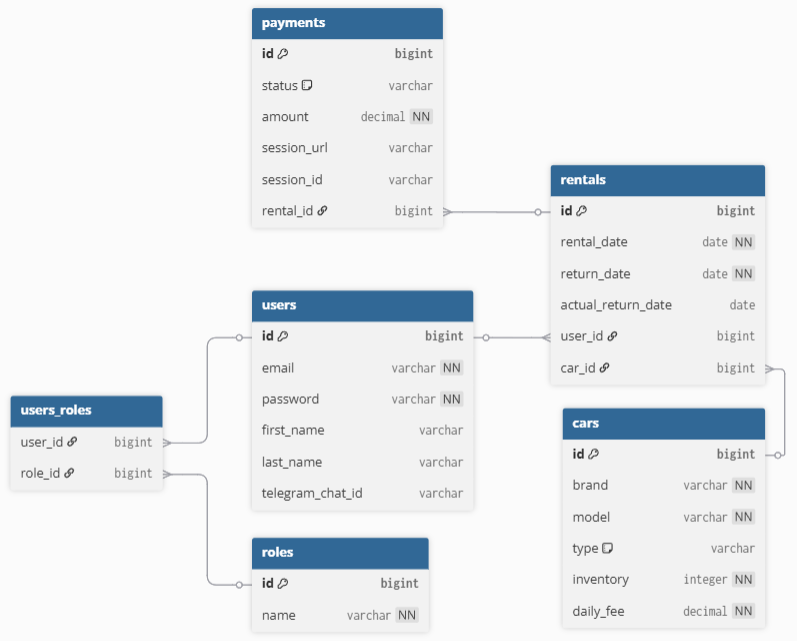

# 🏎️ Car Sharing App

**Car Sharing App** is a scalable backend system built to support a modern car sharing platform.  
Developed with **Java** and **Spring Boot**, it provides a solid foundation for vehicle rentals, user authentication, payment handling through **Stripe**, and real-time notifications via **Telegram**.

---

## Table of contents

- [Key Technologies](#key-technologies)  
- [Architecture Overview](#architecture-overview)
- [List of Controllers](#list-of-controllers)
- [Database Schema Relationship Diagram](#database-schema-relationship-diagram)
- [Fork and Clone the Project on GitHub](#fork-and-clone-the-project-on-github)
- [How to Launch the Application](#how-to-launch-the-application)
- [All Postman Collections](#all-postman-collections)

---

## Key Technologies

- **Java 17** – Primary backend programming language.
- **Maven** – Build automation and dependency management.
- **Spring Boot 3** – Provides autoconfiguration and rapid application development.
- **Spring Security 6** – Manages authentication and authorization via JWT.
- **Spring Data JPA (Hibernate)** – Simplifies database operations with ORM.
- **MapStruct** – Automatic mapping between entities and DTOs.
- **Lombok** – Reduces boilerplate code with annotations.
- **Swagger / OpenAPI** – Interactive API documentation.
- **Stripe API** – Secure payment processing.
- **Telegram Bot API** – Sends real-time user notifications.
- **Scheduler** – Handles automated background tasks.
- **PostgreSQL / H2** – Primary and in-memory databases.
- **Docker** – Ensures consistent deployment environments.
- **JUnit & MockMvc** – Unit and integration testing frameworks.  

[Back to Table of Contents](#table-of-contents)

---

## Architecture Overview

This project follows a **Layered Architecture** to ensure clean separation of concerns, testability, and scalability.

### **Controller Layer**
- Exposes RESTful endpoints for external clients.
- Handles HTTP requests and responses.
- Delegates logic to the corresponding service layer.

### **Service Layer**
- Contains business logic and validation.
- Interacts with repositories and external services (Stripe, Telegram).
- Manages transaction integrity and domain workflows.

### **Repository Layer**
- Handles data access through Spring Data JPA.
- Executes CRUD operations and custom queries.
- Interacts with PostgreSQL or H2 for persistence.

### **Model Layer**
- Defines JPA entities (`User`, `Car`, `Rental`, `Payment`, `Role`).
- Represents core domain objects stored in the database.

### **Mapper Layer**
- Uses **MapStruct** to convert between Entities and DTOs.
- Keeps the service and controller layers clean and concise.

### **Security Layer**
- Implements JWT-based authentication.
- Supports role-based authorization (`USER`, `ADMIN`).
- Handles token generation, validation, and protection of routes.

### **Payment & Notification Layer**
- Integrates with **Stripe** for online transactions.
- Uses **Telegram Bot API** for real-time notifications about rentals or payments.

[Back to Table of Contents](#table-of-contents)

---

## List of Controllers

The backend exposes several REST endpoints grouped by responsibility.

### **AuthenticationController**
- **POST** `/auth/register` – Register a new user.
- **POST** `/auth/login` – Authenticate existing users and receive JWT token.

### **UserController**
- **GET** `/users/me` – View current user profile.
- **PUT** `/users/me` – Update personal details.
- **GET** `/users` – (ADMIN) View all users.

### **CarController**
- **GET** `/cars` – View list of all available cars.
- **GET** `/cars/{id}` – Retrieve car details by ID.
- **POST** `/cars` – (ADMIN) Add a new car.
- **PUT** `/cars/{id}` – (ADMIN) Update car details.
- **DELETE** `/cars/{id}` – (ADMIN) Remove a car.

### **RentalController**
- **POST** `/rentals` – Create a new rental booking.
- **GET** `/rentals/my` – View all rentals for the logged-in user.
- **GET** `/rentals/{id}` – Retrieve details of a specific rental.
- **PUT** `/rentals/{id}/return` – Mark a rental as completed.
- **DELETE** `/rentals/{id}` – Cancel an active rental.

### **PaymentController**
- **POST** `/payments/session` – Create a Stripe checkout session.
- **GET** `/payments/success` – Payment success callback.
- **GET** `/payments/cancel` – Payment cancel callback.

[Back to Table of Contents](#table-of-contents)

---

## Database Schema Relationship Diagram



[Back to Table of Contents](#table-of-contents)

---

## Fork and Clone the Project on GitHub

Forking creates a personal copy of someone else's repository under your GitHub account.

- [Go to the GitHub page of the repository you want to fork](https://github.com/letmerelaxpls/car-sharing-app)
- Click the "Fork" button in the upper-right corner
- Select your GitHub account (or organization) to create the fork

  You now have your own copy of the project.

Make sure you have Git installed on your machine

- You can check by running:
```
git --version
```

Clone the repository to your local machine:
```
git clone https://github.com/letmerelaxpls/car-sharing-app.git
cd car-sharing-app
```

[Back to Table of Contents](#table-of-contents)

---

## How to Launch the Application

Before launching, ensure you have the following installed:

- Java 17+
- Maven 3.8+
- Docker & Docker Compose

1. Configure Environment Variables 
Create a .env file in the project root (you can copy from .env.example):
    ```
   SPRING_DATASOURCE_URL=jdbc:postgresql://localhost:5432/carsharing
   SPRING_DATASOURCE_USERNAME=postgres
   SPRING_DATASOURCE_PASSWORD=postgres
   JWT_SECRET=your_secret_key
   STRIPE_SECRET_KEY=your_stripe_key
   TELEGRAM_BOT_TOKEN=your_telegram_bot_token
   PAYMENT_SUCCESS_URL=http://localhost:8080/payments/success
   PAYMENT_CANCEL_URL=http://localhost:8080/payments/cancel
    ```
2. Run with Maven
    ```
    mvn clean package
    mvn spring-boot:run
    ```
3. Or Run with Docker Compose
    ```
   docker compose up --build
    ```
Once the application starts, open Swagger to explore the API:
```text
http://localhost:8080/swagger-ui/index.html
```

[Back to Table of Contents](#table-of-contents)

---

## All Postman Collections

You can import the prepared Postman collection to quickly test all API endpoints.

[Postman collections](car-sharing-app.postman_collection.json)

[Back to Table of Contents](#table-of-contents)